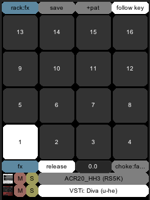

# D3CK reaper tools

## installation

to install and use in reaper simply clone this repo to reaper's `Scripts` directory
eg `Scripts/D3CK`

`notice! some path assumptions are made!`

Theses scripts assume to reside in the path mentioned above and will also write to reaper's
`Effects\D3CK` direcory to ensure supporting 'jsfx' are installed

to run, choose one of the scripts from the app directory
this is a very early alpha version, so expect things not to break

## DrumRack / ZoneMan (apps/drumRack.lua)

a drum rack for reaper.
this script offers a convenient UI for managing instrument tracks and trigger them with
with midi notes

### features

+ layer samples and synth, create drum kits from all sorts of sound sources
+ drag and drop `audio files` to pads creates layers of reasamplomatic5000 instances
+ drag and drop `track templates` creates layers from those (using the first track as sound source)
+ create pads/layer from existing racks tracks, etc.
+ flip and/or copy pads by drag and drop
+ pads can 'choke' each other
+ multiple playback modes: pads can have fixed length (time) regular press and release or infintie length / one shot mode
+ solo/mute/edit/delete layers/instruments
+ save/load kits (handled as regular track templates)
+ managed fx bus and fx per pad
+ context actions (right click on pads and layers)
+ fx/pad/layer locking (not very useful yet)
+ split mode, use key-ranges instead of a pad grid
+ follow pad selection by midi input

+ no internal state is kept, e.g. the drum rack is completely driven by the track structure underneath and a "hub" plugin distributing the midi data to the pads and layers, which themselves are just plain tracks.

### roadmap

+ pad/layer/fx presets
+ flip through kits and pads
+ sample slicing workflow
+ partial loading of kits (e.g. spare locked pads/settings, also for slicing flow)
+ better split mode
+ more pads/zones (128)
+ sequencer integration
+ reapack integration

license: MIT